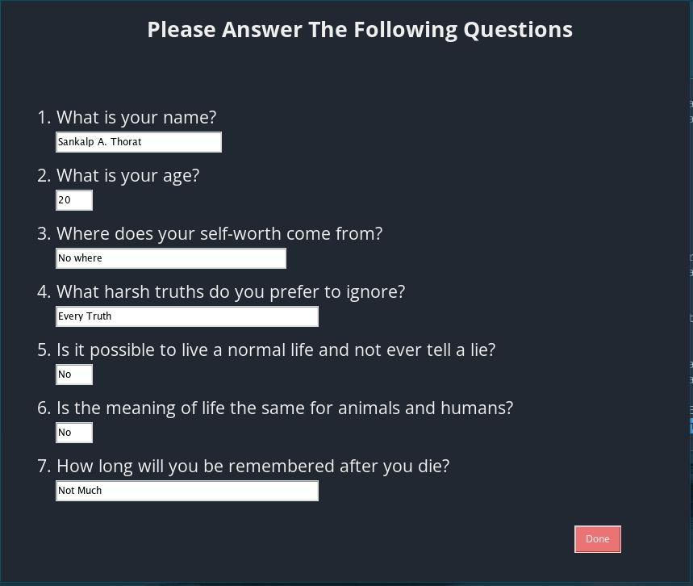

#TK-Interface Python Assignment
It's the second assignment from my python class where, I have to create a survey form or a questionnare. 
So I created a questionnare about some philosophical stuff.

###Instructions To Run It On Your Machine
1. Clone this repository onto your machine: ``git clone https://github.com/bleak-alpha/tkgui-assignment.git``
2. Navigate into the repository: ``cd tkgui-assignment``
3. Execute the file: ``python form.py``

###Screenshots

